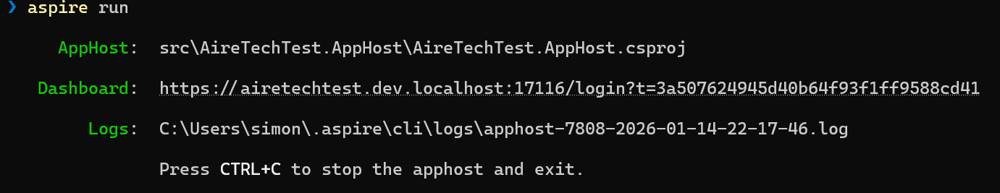

# Patient Appointment Network Data Application

See https://github.com/airelogic/tech-test-portal/blob/main/Patient-Appointment-Backend/README.md for details of requirements

## Running locally

Install the Aspire CLI tool:

```powershell
irm https://aspire.dev/install.ps1 | iex
```

Ensure that Docker Desktop is installed and running.

Run the application:

```powershell
aspire run
```

When the application is running click the Dashboard link to view the dashboard in the browser.



The database will start up in a Docker container and once it is ready the API will be available by clicking on the `Test API` link in the Dashboard.

You can then interact with the API using the Scalar UI.

## Test Data

In the development environment the test data is automatically loaded into the database so that there's something to test with.

### Implemenation Notes

- Appointments should be considered 'missed' if they are not set to 'attended' by the end of the appointment.
  - TODO
- Ensure that all [NHS numbers are checksum validated](https://www.datadictionary.nhs.uk/attributes/nhs_number.html).
  - I chose to use a ValueObject for this to provide validation and to make it a Domain object instead of a string. 
- Ensure that all [postcodes can be coerced into the correct format](https://ideal-postcodes.co.uk/guides/uk-postcode-format).
  - Same rationale as for NHS numbers.
- They're flexible about how they interact with the API, as long as you can provide guidance and they can get data in JSON format.
    - Data is returned in JSON format.
- Due to time constraints, they will not be able to properly validate the inbound data in the frontend, but can
  propagate error responses returned by the backend.
    - Full validation is performed in the backend.
- All timestamp passed between the backend and frontend must be timezone-aware.
  - Timestamps are stored in UTC and when returned to the frontend they retain the original timezone.
- The client has been burned by vendor lock-in in the past, and prefers working with smaller frameworks.
  - I chose to use ASP.NET Core and Entity Framework Core as they are well-known and well-supported. Use of Vogen was a personal preference and in a real-life scenario wouldn't need to be a requirement if the client wasn't comfortable with the use of a third-party package.
- The client highly values automated tests, particularly those which ensure their business logic is implemented
  correctly.
  - Unit and integration tests have been implemented.
- The client is in negotiation with several database vendors, and is interested in being database-agnostic
  if possible.
  - By using Entity Framework and hosting a database in Docker, it should be relatively straight forward to change the database provider.
- The client is somewhat concerned that missed appointments waste significant amounts of clinicians' time,
  and is interested in tracking the impact this has over time on a per-clinician and per-department basis.
  - TODO
- The client would like to ensure that [patient names can be represented correctly, in line with GDPR](https://shkspr.mobi/blog/2021/10/ebcdic-is-incompatible-with-gdpr/).
  - Data is stored in UTF-8 and returned to the frontend in UTF-8 so this isn't an issue.

### Not Implememted

- Appointments can be cancelled, but cancelled appointments cannot be reinstated.
  - I felt this was ambiguous so chose not address it.
- The PANDA currently doesn't contain much data about clinicians, but will eventually track data about the specific organisations they currently work for and where they work from.
  - The database could be updated to have a clinician table, but we would then need to implement endpoints for maintaining that data.
- The client is interested in branching out into foreign markets, it would be useful if error messages could be localised.